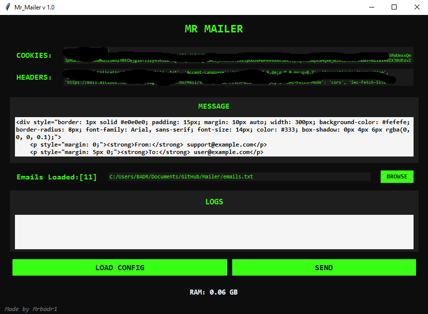
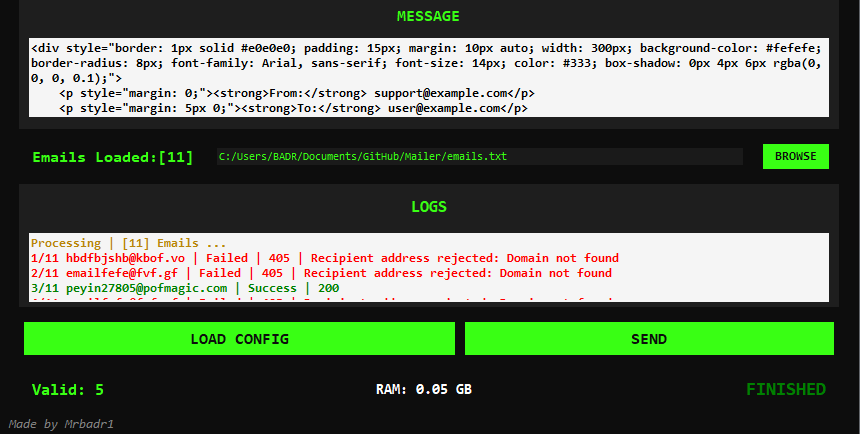

# Bulk Email Sender

A Python application built with Tkinter for sending bulk HTML emails. This app supports logging to track email-sending events and provides a user-friendly interface for managing your email campaigns.

---

## Screenshots

### 1. Application Interface


### 2. Email Sent Successfully


---

## Features
- Send bulk emails with ease.
- Support for HTML or plain text email formats.
- Load email lists and configuration files.
- Logging of email-sending events.

---

## Prerequisites

Before you begin, ensure you have the following:
- Python installed on your Windows machine.

---

## Installation

### 1. **Install Python**
Ensure Python is installed on your Windows machine. You can download it from [Python’s official website](https://www.python.org/).

### 2. **Create your `config.txt` file**
Add your configuration details (e.g., email server settings) in this file.

**Example `config.txt` Format:**
```plaintext
headers = {
    'Accept': 'application/json, text/plain, */*',
    'Accept-Language': 'en-US,en;q=0.9,de;q=0.8,no;q=0.7',
    'Connection': 'keep-alive',
    'Content-Type': 'application/json;charset=UTF-8',
    'Origin': 'https://mail.example.com',
    'Referer': 'https://mail.example.com/Mail/view',
    'User-Agent': 'Mozilla/5.0 (Windows NT 10.0; Win64; x64) AppleWebKit/537.36 (KHTML, like Gecko) Chrome/131.0.0.0 Safari/537.36',
    'X-XSRF-TOKEN': 'example-token',
    'sec-ch-ua': '"Google Chrome";v="131", "Chromium";v="131", "Not_A Brand";v="24"',
    'sec-ch-ua-mobile': '?0',
    'sec-ch-ua-platform': '"Windows"',
}

cookies = {
    'XSRF-TOKEN': 'example-token',
    '_gcl_au': '1.1.example',
    '_ga': 'GA1.2.example',
}

email_settings = {
    'from': 'Customer Service <support@example.com>',
    'locale': 'en',
    'subject': 'Your Support Request',
}

email_url = "https://mail.example.com/send"
```

### 3. **Prepare your `emails.txt` file**
Add the list of email addresses, with each email on a new line.

**Example `emails.txt` Format:**
```plaintext
example1@example.com
example2@example.net
example3@example.org
```

---

## Usage

### 1. Open the Application Directory
Navigate to the directory containing the script using **VS Code** or **CMD**.

### 2. Run the Mailer Script
Run the `Mr_Mailer.py` script to automatically install required dependencies:
```bash
python Mr_Mailer.py
```

### 3. Load Your Configuration
- In the mailer interface, load the `config.txt` file.

### 4. Load Your Email List
- Load the `emails.txt` file containing your email addresses.

### 5. Compose Your Message
- Enter your message in HTML format or plain text.

### 6. Send Emails
- Click the **"Send"** button to start sending emails.
- A valid "Send" button will appear in green if everything is set up correctly.

---

## Notes

- Ensure your `config.txt` file contains all the necessary configuration details for your email server.
- Verify your `emails.txt` file is formatted correctly.
- Logs will be generated automatically for easy troubleshooting.

---

## Professional Tip
Add personalization to your emails by using placeholders like `{name}` in your HTML. Replace them dynamically while sending emails to create a personalized touch for your recipients.

---

## Made for Fun
Happy emailing! 😊  
**Author:** Mrbadr1

> _Bringing email campaigns to life, one bulk send at a time!_

